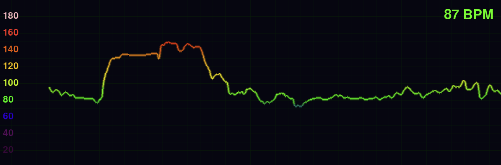

# Pulse Stream

Real-time heart rate visualization from Polar H10 chest strap. Ideal for Stream overlays or just for fun.



[Demo Video](heartrate.mp4)

## Setup

```bash
python3 -m venv venv 
source venv/bin/activate
pip install -r requirements.txt
python pulsestream.py
```

## Requirements

- Polar H10 chest strap
- Bluetooth enabled
- Python 3.7+